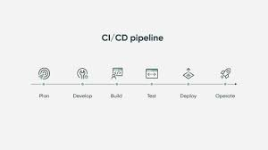

# Continuous Integration and Continuous Deployment (CI/CD)

## What is Continuous Integration and Continuous Deployment?
Continuous integration (CI) is the practice of automating the integration of code changes from multiple contributors into a single software project.

Continuous deployment (CD) is a strategy in software development where code changes to an application are released automatically into the production environment.

## Benefits of CI and CD
Both Continuous Integration and Continuous Deployment have indvidual benefits that when combined lead to improved efficency in software development in teams.

### Continuous Integration
- <b>Faster Iteration</b>: Changes can be more confidently and frequently committed, leading to faster development and release cycles.
- <b>Reduced Risk</b>: Regular integration helps detect and locate issues early, making them less costly and easier to fix.
- <b>Efficiency</b>: Developers spend less time debugging and more time building new features, which leads to a more efficent team.

### Continuous Deployment
- <b>Consistentency</b>: The environment setup and deployment process is consistent due to automation, reducing the chances of environment-specific failures.
- <b>Reliability</b>: Frequent releases make the process predictable and improve the system's stability and reliability.
- <b>Time-to-Market</b>: Changes can be released to customers quickly, increasing the speed of delivery for new features and reducing the amount of downtime and ticket requests

## Best Practices of Continuous Integration and Continuous Deployment?

1. **Commit Daily:** When your teams commit daily, they help incorporate features into production. Introducing changes quickly into production can save you time in the long run.

2. **Test Code in Early Stages:** Rather than waiting until deployment to test functionality and usability, you should run tests at each stage of the software development cycle to prevent bugs and other issues from entering the pipeline.

3. **Identify Tests that can be Automated:** Any test that doesn’t require human interaction should be automated and integrated into the pipeline as a rule of thumb.

4. **Add an observability tool to your pipeline:** Adding an observability platform like Middleware, Datadog or Splunk can help system admins continuously monitor and troubleshoot their CI/CD process and to help developers increase the reliability and speed of their CI/CD pipelines.

5. **Use on-demand testing environments:** On-demand environments offer you a clean spacer to run tests or deployment pipelines. You don’t need to worry about other teams’ code or previous builds affecting your current environment. On-demand environments also help drive down CI/CD costs by recycling resources when they’re no longer in use.

6. **Involve the whole team in the CI/CD implementation:** DevOps teams that embrace CI/CD best practices benefit the most from improving their software delivery. IT teams should include product owners, developers, quality assurance engineers, and operations engineers in the implementation. It’ll also help if you involve external stakeholders, such as customers and end-users, for review and feedback. This way, everyone feels connected to the implementation and can provide valuable input.

## Pitfalls to Avoid
- <b>Infrequent Commits</b>, developers should commit their changes frequently to avoid integration problems.
- <b>Lack of Communication</b>, every team member should be instantly informed about the build status after a change.
- <b>Lack of Documentation</b>, documenting the process, changes, and the system status is crucial for maintaining and troubleshooting the CI/CD pipeline.

## References
- What is CI/CD? - InfoWorld 
https://www.infoworld.com/article/3271126/what-is-cicd-continuous-integration-and-continuous-delivery-explained.html#:~:text=A%20mature%20devops%20team%20with,directly%20to%20the%20production%20environment.

- 5 common pitfalls of CI/CD—and how to avoid them -InfoWorld
https://www.infoworld.com/article/3113680/5-common-pitfalls-of-cicd-and-how-to-avoid-them.html

- Continuous Integration vs. Delivery vs. Deployment - JetBrains  
https://www.jetbrains.com/teamcity/ci-cd-guide/continuous-integration-vs-delivery-vs-deployment/#:~:text=Continuous%20integration%2C%20delivery%20and%20deployment,software%20to%20users%20a%20reality.

- Know The Common Mistakes In CI/CD - ForgeAhead
https://forgeahead.io/blog/common-mistakes-in-ci-cd/

- How To Set Up a Continuous Integration & Delivery (CI/CD) Pipeline - BMC 
https://www.bmc.com/blogs/ci-cd-pipeline-setup/

- [CI/CD Best Practices - Middleware.io](https://middleware.io/blog/ci-cd-best-practices/)